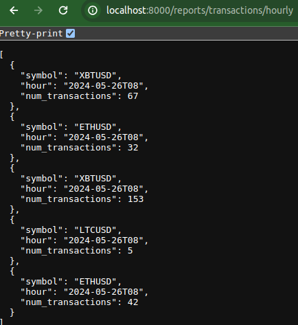
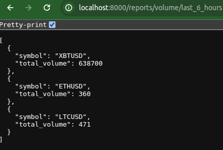

# `PLS, GIVE US 13.72 points... 🙏🥹🥲🙏`
 We spent an enourmous amount of human-hours trying to fire up Cassandra to work with Spark and failed, coming back to MongoDB..

# Docs

Here's an improved version of the markdown:

## Design

Our system consists of several containerized components, all orchestrated using a single Docker Compose setup. The components are as follows:

1. **Kafka**: We chose Kafka as our message queue due to our familiarity with it and its ease of setup and debugging. We created a topic called `crypto_data` and a Producer that writes data from a WebSocket to this topic.
2. **WebSocket Microservice**: This microservice continuously streams data to our Kafka topic `crypto_data`.
3. **MongoDB**: We use MongoDB as our database to store the processed data.
4. **Spark**: Spark is utilized for both stream and batch processing of data.
5. **Spark Stream Processing**: This container processes messages from the Kafka topic. It formats the messages and writes them to the `raw_transactions` collection in MongoDB.
6. **Spark Batch Processing**: This container aggregates data according to specified requirements and writes the results to the `aggregated_transactions` collection in MongoDB.
7. **REST API Microservice**: This microservice provides REST API endpoints to access the data in our database and return it via GET requests.

Each component is designed to work together seamlessly, ensuring efficient data processing and retrieval.

The table structure can be observed from diagram

## Diagram of the architecture


## Results

### Category A endpoints:
`1` **Return the aggregated statistics containing the number of transactions for each cryptocurrency for each hour in the last 6 hours, excluding the previous hour.**<br>


`2` **Return the statistics about the total trading volume for each cryptocurrency for the last 6 hours, excluding the previous hour.**<br>


`3` **Return aggregated statistics containing the number of trades and their total volume for each hour in the last 12 hours, excluding the current hour.**<br>


### Category B endpoints:
`1` **Return the number of trades processed in a specific cryptocurrency in the last N minutes, excluding the last minute.**<br>


`2` **Return the top N cryptocurrencies with the highest trading volume in the last hour.**<br>


`3` **Return the cryptocurrency’s current price for «Buy» and «Sell» sides based on its symbol.**<br>


## Configuration

Configure currencies you want to track in [`websocket-client/config.json`](./websocket-client/config.json) file:
```json
{
    "currencies": ["XBTUSD", "ETHUSD", "LTCUSD"]
}
```

## Deployment
`1`
**Launch the application**
```bash
docker-compose up --build -d
```


## Debug
`1`
**Launch admin console**
```bash
./admin-tools/start.sh
```
